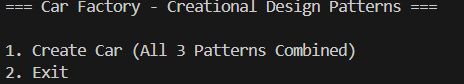
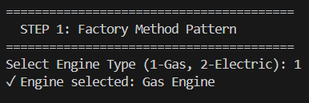
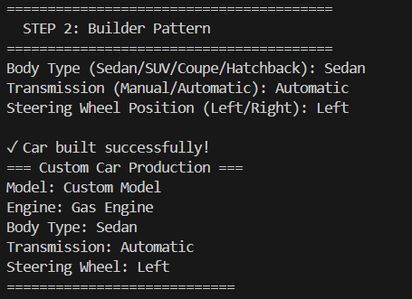
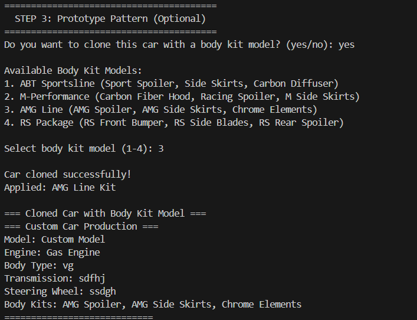

# Car Factory - Creational Design Patterns

**Laboratory Work #1** - Software Design Techniques and Mechanisms  
**Author:** Petcov Nicolai, FAF-233

---

## Objectives
1. Study and understand Creational Design Patterns
2. Choose a domain and define main classes/models/entities
3. Implement at least 3 creational design patterns in a sample project

## Domain Area
**Automotive Manufacturing** - Custom Car Factory System

This project simulates a modern car factory where customers can:
- Select engine type (Gas or Electric)
- Customize car specifications (body, transmission, steering)
- Clone existing configurations and add modifications

---

## Design Patterns Implementation

### 1. Factory Method Pattern
**Purpose:** Create engine objects without specifying exact classes

**How it works:**
- Client selects engine type (Gas/Electric)
- Factory creates appropriate engine instance
- Encapsulates object creation logic

```java
Engine engine = engineChoice == 1 ? new GasEngine() : new ElectricEngine();
```

**Benefits:**
- Decouples object creation from usage
- Easy to extend with new engine types
- Single responsibility - factory handles creation

---

### 2. Builder Pattern
**Purpose:** Construct complex car objects step-by-step

**How it works:**
- Set body type, transmission, and steering position
- Build car with fluent interface
- Optional parameters with sensible defaults

```java
CustomCar car = new CarBuilder("Custom Model", engine)
    .setBodyType("SUV")
    .setTransmission("Automatic")
    .setSteeringWheelPosition("Left")
    .build();
```

**Benefits:**
- Readable and maintainable code
- Flexible configuration process
- Immutable result object

---

### 3. Prototype Pattern
**Purpose:** Clone existing cars and apply predefined body kit models

**How it works:**
- Clone an existing car configuration
- Select from predefined body kit models (ABT, M-Performance, AMG, RS)
- Automatically apply complete body kit package to cloned car

```java
CustomCar clonedCar = originalCar.clone();
// Apply predefined body kit model
clonedCar.addBodyKit("Sport Spoiler");
clonedCar.addBodyKit("Side Skirts");
clonedCar.addBodyKit("Carbon Diffuser");
```

**Available Body Kit Models:**
- **ABT Sportsline**: Sport Spoiler, Side Skirts, Carbon Diffuser
- **M-Performance**: Carbon Fiber Hood, Racing Spoiler, M Side Skirts
- **AMG Line**: AMG Spoiler, AMG Side Skirts, Chrome Elements
- **RS Package**: RS Front Bumper, RS Side Blades, RS Rear Spoiler

**Benefits:**
- Avoid expensive re-configuration
- Quick customization with professional body kits
- Preserves original object state

---

## Combined Pattern Flow

The application combines all 3 patterns in a unified workflow:

**STEP 1: Factory Method** → Select engine type  
**STEP 2: Builder Pattern** → Configure car specifications  
**STEP 3: Prototype Pattern** → Optionally clone and add body kits

## Project Structure

```
src/main/java/
├── client/                          # Client layer
│   ├── Main.java                   # Application entry point
│   └── FactoryApp.java             # User interface & application logic
├── domain/
│   ├── factory/                    # Factory pattern implementations
│   │   └── CarFactory.java         # Factory Method pattern
│   └── models/                     # Domain models
│       ├── Car.java                # Abstract car class
│       ├── CarBuilder.java         # Builder pattern
│       ├── CarType.java            # Enum for car types
│       ├── CustomCar.java          # Custom car with Prototype pattern
│       ├── ElectricCar.java        # Concrete electric car
│       ├── GasCar.java             # Concrete gas car
│       ├── Engine.java             # Engine interface
│       ├── ElectricEngine.java     # Electric engine implementation
│       └── GasEngine.java          # Gas engine implementation
```

## How to Run

```bash
# 1. Navigate to project root
cd /home/fuckedupupd/SDTM-Labs

# 2. Compile the project
mvn clean compile

# 3. Run the application
java -cp target/classes client.Main
```

---

## Screenshots

### Main Menu


*Application entry point showing the unified pattern approach*

### Step 1: Factory Method Pattern - Engine Selection


*User selects engine type (Gas or Electric) using Factory Method pattern*

### Step 2: Builder Pattern - Car Configuration


*Building custom car with body type, transmission, and steering position*

### Step 3: Prototype Pattern - Clone & Customize


*Cloning existing car and adding custom body kits*

---

## Application Flow

```
========================================
  STEP 1: Factory Method Pattern
========================================
Select Engine Type (1-Gas, 2-Electric): 1
Engine selected: Gas Engine

========================================
  STEP 2: Builder Pattern
========================================
Body Type (Sedan/SUV/Coupe/Hatchback): SUV
Transmission (Manual/Automatic): Automatic
Steering Wheel Position (Left/Right): Left

Car built successfully!
=== Custom Car Production ===
Model: Custom Model
Engine: Gas Engine
Body Type: SUV
Transmission: Automatic
Steering Wheel: Left

========================================
  STEP 3: Prototype Pattern (Optional)
========================================
Do you want to clone this car with a body kit model? (yes/no): yes

Available Body Kit Models:
1. ABT Sportsline (Sport Spoiler, Side Skirts, Carbon Diffuser)
2. M-Performance (Carbon Fiber Hood, Racing Spoiler, M Side Skirts)
3. AMG Line (AMG Spoiler, AMG Side Skirts, Chrome Elements)
4. RS Package (RS Front Bumper, RS Side Blades, RS Rear Spoiler)

Select body kit model (1-4): 1

Car cloned successfully!
Applied: ABT Sportsline Kit

=== Cloned Car with Body Kit Model ===
Model: Custom Model
Engine: Gas Engine
Body Type: SUV
Transmission: Automatic
Steering Wheel: Left
Body Kits: Sport Spoiler, Side Skirts, Carbon Diffuser
============================

========================================
  Summary: Total cars created: 2
========================================
```

---

## SOLID Principles Applied

| Principle | Implementation |
|-----------|---------------|
| **Single Responsibility** | Each class has one clear purpose (Car, Engine, Factory, Builder) |
| **Open-Closed** | Open for extension (new car/engine types), closed for modification |
| **Dependency Inversion** | Depend on abstractions (Engine interface, Car abstract class) |

---

## Key Features

- **3 Creational Patterns** working together seamlessly
- **Clean Architecture** with proper package separation
- **Pure Java** - no external frameworks or libraries
- **Interactive CLI** with step-by-step guidance
- **Extensible Design** for easy future enhancements
- **SOLID Principles** for maintainable code

---

## Technologies

| Technology | Version |
|------------|---------|
| **Language** | Java 21 |
| **Build Tool** | Maven 3.x |
| **Architecture** | Layered (Client → Domain) |

---

## Conclusion

This project successfully demonstrates the power of Creational Design Patterns working together. The Factory Method provides flexibility in engine selection, the Builder Pattern enables complex object construction, and the Prototype Pattern allows efficient object cloning and customization. Combined, these patterns create a robust, maintainable, and extensible car factory system.
