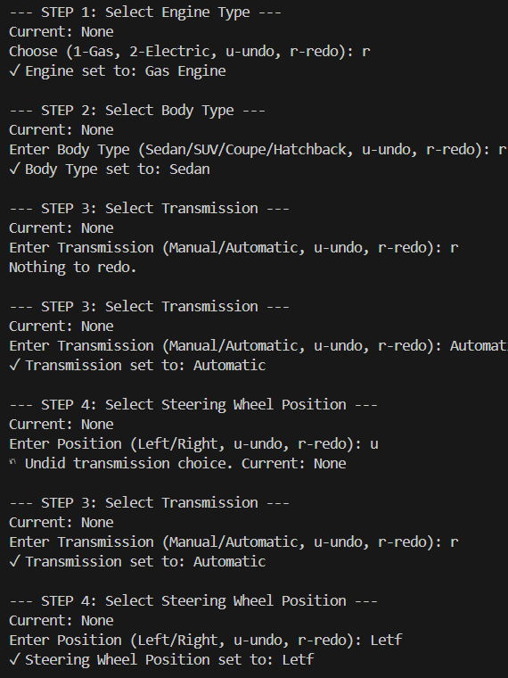
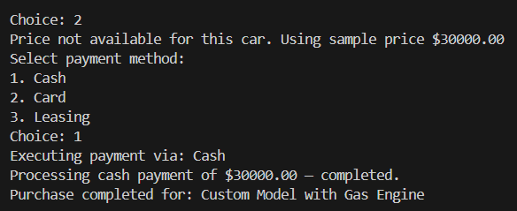
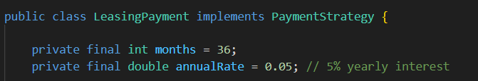

# Laboratory Work #3: Behavioral Design Patterns

**Author:** Nicolai Petcov 
**Group:** FAF-233  
**Variant:** Car Factory System

---

## Introduction / Theory / Motivation

Behavioral design patterns are concerned with algorithms and the assignment of responsibilities between objects. These patterns characterize complex control flow that's difficult to follow at run-time and shift focus away from control flow to let you concentrate on the way objects are interconnected.

In this laboratory work, we implemented **two** behavioral design patterns to enhance the Car Factory system:

1. **Strategy Pattern** – to provide flexible payment methods (Cash, Card, Leasing) for purchasing cars.
2. **Command Pattern** – to allow undoing/redoing configuration choices during car creation (engine, body type, transmission, steering).

### Why These Patterns?

- **Strategy Pattern** is essential when you have multiple algorithms (payment methods) that should be interchangeable at runtime. It eliminates large `if-else` or `switch` blocks and makes adding new payment methods easy without modifying existing code (Open-Closed Principle).

- **Command Pattern** enables us to encapsulate configuration actions (like choosing engine type) as command objects. This allows us to:
  - Support undo/redo operations at each configuration step.
  - Provide users with full control over their choices.
  - Queue or log operations.
  - Decouple the invoker (user menu) from the receiver (car configuration).

Together, these patterns demonstrate how behavioral design patterns facilitate communication and flexibility in a system.

---

## Implementation & Explanation

### 1. Strategy Pattern – Payment Methods

**Location:**  
`src/main/java/domain/strategy/`

**Files:**
- `PaymentStrategy.java` (interface)
- `CashPayment.java`
- `CardPayment.java`
- `LeasingPayment.java`

**Main Idea:**

The Strategy pattern defines a family of algorithms (payment methods), encapsulates each one, and makes them interchangeable. The client (`FactoryApp`) can choose which payment strategy to use at runtime without knowing the implementation details.

**Code Snippets:**

**PaymentStrategy.java:**
```java
package domain.strategy;

public interface PaymentStrategy {
    boolean pay(double amount);
    String getName();
}
```

**CashPayment.java:**
```java
package domain.strategy;

public class CashPayment implements PaymentStrategy {
    @Override
    public boolean pay(double amount) {
        System.out.println("Processing cash payment of $" + String.format("%.2f", amount) + " — completed.");
        return true;
    }

    @Override
    public String getName() {
        return "Cash";
    }
}
```

**CardPayment.java:**
```java
package domain.strategy;

public class CardPayment implements PaymentStrategy {
    private final double cardFeeRate = 0.02; // 2% fee

    @Override
    public boolean pay(double amount) {
        double fee = amount * cardFeeRate;
        double total = amount + fee;
        System.out.println("Processing card payment: amount=$" + String.format("%.2f", amount)
                + ", fee=$" + String.format("%.2f", fee) + ", total=$" + String.format("%.2f", total));
        System.out.println("Payment completed via card.");
        return true;
    }

    @Override
    public String getName() {
        return "Card (2% fee)";
    }
}
```

**LeasingPayment.java:**
```java
package domain.strategy;

public class LeasingPayment implements PaymentStrategy {
    private final int months = 36;
    private final double annualRate = 0.05; // 5% yearly interest

    @Override
    public boolean pay(double amount) {
        double monthlyRate = annualRate / 12.0;
        double monthly = (amount * monthlyRate) / (1 - Math.pow(1 + monthlyRate, -months));
        System.out.println("Processing leasing for $" + String.format("%.2f", amount) + " over " + months + " months.");
        System.out.println("Estimated monthly payment: $" + String.format("%.2f", monthly));
        System.out.println("Leasing contract simulated (no real payment). ");
        return true;
    }

    @Override
    public String getName() {
        return "Leasing (36 months)";
    }
}
```

**Integration in FactoryApp.java:**

```java
private void purchaseCarWithPaymentStrategy(Scanner scanner) {
    // ... select car ...
    
    System.out.println("Select payment method:");
    System.out.println("1. Cash");
    System.out.println("2. Card");
    System.out.println("3. Leasing");
    System.out.print("Choice: ");
    int payChoice = scanner.nextInt();
    scanner.nextLine();

    PaymentStrategy strategy;
    switch (payChoice) {
        case 1: strategy = new CashPayment(); break;
        case 2: strategy = new CardPayment(); break;
        case 3: strategy = new LeasingPayment(); break;
        default:
            System.out.println("Invalid payment method!\n");
            return;
    }

    System.out.println("Executing payment via: " + strategy.getName());
    boolean ok = strategy.pay(amount);
    if (ok) {
        System.out.println("Purchase completed for: " + selected.getDescription() + "\n");
    }
}
```

**Motivation:**
- Adding new payment methods (e.g., cryptocurrency, bank transfer) requires only creating a new class implementing `PaymentStrategy`.
- No need to modify existing payment logic.
- Follows **Open-Closed Principle** and **Single Responsibility Principle**.

---

### 2. Command Pattern – Undo/Redo During Car Configuration

**Location:**  
`src/main/java/domain/command/`

**Files:**
- `Command.java` (interface)
- `CommandHistory.java` (manages undo/redo stacks)
- `ChooseEngineCommand.java`
- `SetBodyTypeCommand.java`
- `SetTransmissionCommand.java`
- `SetSteeringCommand.java`

**Main Idea:**

The Command pattern encapsulates each configuration step (choosing engine, body type, transmission, steering) as a command object. This allows users to undo/redo their choices during the car creation process, providing full control over configuration.

**Code Snippets:**

**Command.java:**
```java
package domain.command;

public interface Command {
    void execute();
    void undo();
}
```

**CommandHistory.java:**
```java
package domain.command;

import java.util.Stack;

public class CommandHistory {
    private final Stack<Command> undoStack = new Stack<>();
    private final Stack<Command> redoStack = new Stack<>();

    public void execute(Command cmd) {
        cmd.execute();
        undoStack.push(cmd);
        redoStack.clear();
    }

    public boolean canUndo() {
        return !undoStack.isEmpty();
    }

    public void undo() {
        if (!undoStack.isEmpty()) {
            Command cmd = undoStack.pop();
            cmd.undo();
            redoStack.push(cmd);
        }
    }

    public boolean canRedo() {
        return !redoStack.isEmpty();
    }

    public void redo() {
        if (!redoStack.isEmpty()) {
            Command cmd = redoStack.pop();
            cmd.execute();
            undoStack.push(cmd);
        }
    }
}
```

**ChooseEngineCommand.java:**
```java
package domain.command;

import domain.models.Engine;

public class ChooseEngineCommand implements Command {
    private Engine[] currentEngine;
    private Engine newEngine;
    private Engine previousEngine;

    public ChooseEngineCommand(Engine[] currentEngine, Engine newEngine) {
        this.currentEngine = currentEngine;
        this.newEngine = newEngine;
    }

    @Override
    public void execute() {
        previousEngine = currentEngine[0];
        currentEngine[0] = newEngine;
        System.out.println("✓ Engine set to: " + newEngine.getType());
    }

    @Override
    public void undo() {
        currentEngine[0] = previousEngine;
        String type = (previousEngine != null) ? previousEngine.getType() : "None";
        System.out.println("↶ Undid engine choice. Current: " + type);
    }
}
```

**Integration in FactoryApp.java:**

The Command pattern is integrated directly into the **"Create Car"** menu option (option 1). At each configuration step (engine, body type, transmission, steering), users can:
- Enter their choice
- Type `u` to undo the last action
- Type `r` to redo an undone action
- Type `c` to continue to the next step

```java
private void createCarWithAllPatterns(Scanner scanner) {
    CommandHistory history = new CommandHistory();
    
    Engine[] engineHolder = new Engine[1];
    String[] bodyTypeHolder = new String[1];
    String[] transmissionHolder = new String[1];
    String[] steeringHolder = new String[1];
    
    // STEP 1: Choose Engine with undo/redo
    while (true) {
        System.out.println("\n--- STEP 1: Select Engine Type ---");
        String current = (engineHolder[0] != null) ? engineHolder[0].getType() : "None";
        System.out.println("Current: " + current);
        System.out.print("Choose (1-Gas, 2-Electric) or (u-undo, r-redo, c-continue): ");
        String input = scanner.nextLine().trim();
        
        if (input.equalsIgnoreCase("u")) {
            if (history.canUndo()) history.undo();
            else System.out.println("Nothing to undo.");
        } else if (input.equalsIgnoreCase("r")) {
            if (history.canRedo()) history.redo();
            else System.out.println("Nothing to redo.");
        } else if (input.equalsIgnoreCase("c")) {
            if (engineHolder[0] != null) break;
            else System.out.println("Please select an engine first!");
        } else {
            try {
                int choice = Integer.parseInt(input);
                Engine engine = (choice == 1) ? new GasEngine() : new ElectricEngine();
                ChooseEngineCommand cmd = new ChooseEngineCommand(engineHolder, engine);
                history.execute(cmd);
            } catch (NumberFormatException e) {
                System.out.println("Invalid input!");
            }
        }
    }
    
    // Similar loops for body type, transmission, and steering...
    
    // Build final car
    CustomCar newCar = new CarBuilder("Custom Model", engineHolder[0])
            .setBodyType(bodyTypeHolder[0])
            .setTransmission(transmissionHolder[0])
            .setSteeringWheelPosition(steeringHolder[0])
            .build();
}
```

**Motivation:**
- Users can freely experiment with different configurations and undo mistakes.
- The command pattern decouples the UI (menu) from business logic (car configuration).
- Makes the system extensible: new configuration steps can be added as new Command classes.
- Demonstrates real-world use case: configuration wizards with undo/redo support.

---

## Results / Screenshots / Conclusions

### Results

- **Two behavioral patterns** successfully integrated:
  - **Strategy Pattern** for flexible payment methods (Cash, Card, Leasing).
  - **Command Pattern** for undo/redo during car configuration steps.
  
- The project structure remains clean and organized:
  ```
  src/main/java/
  ├── client/
  │   ├── Main.java
  │   └── FactoryApp.java (updated with Command pattern in option 1)
  └── domain/
      ├── command/
      │   ├── Command.java
      │   ├── CommandHistory.java
      │   ├── ChooseEngineCommand.java
      │   ├── SetBodyTypeCommand.java
      │   ├── SetTransmissionCommand.java
      │   └── SetSteeringCommand.java
      ├── strategy/
      │   ├── PaymentStrategy.java
      │   ├── CashPayment.java
      │   ├── CardPayment.java
      │   └── LeasingPayment.java
      ├── decorators/
      ├── factory/
      ├── models/
      └── proxy/
  ```

- All patterns (Creational + Structural + Behavioral) work together seamlessly in a single client (`FactoryApp`).

### Demonstration

#### Command Pattern Demo (Integrated in "Create Car"):
1. User selects option 1 "Create Car".
2. **Step 1:** Choose engine (1-Gas, 2-Electric)
   - User can type `u` to undo, `r` to redo, `c` to continue
3. **Step 2:** Enter body type
   - User can type `u` to undo previous choices, `r` to redo, `c` to continue
4. **Step 3:** Enter transmission
   - Full undo/redo support
5. **Step 4:** Enter steering wheel position
   - Full undo/redo support
6. Car is built with final configuration.

**Key Feature:** At any step, users can undo back to previous steps, change their mind, and redo forward. This provides complete control over the configuration process.

#### Strategy Pattern Demo:
1. User creates a car.
2. User selects option 3 "Purchase Car".
3. User chooses payment method:
   - **Cash:** Full payment processed immediately.
   - **Card:** Payment + 2% fee calculated and processed.
   - **Leasing:** Monthly payment calculated over 36 months.

### Screenshots

#### Command Pattern - Undo/Redo Functionality


*Figure 1: Command pattern in action - users can undo/redo their configuration choices at each step during car creation.*

#### Strategy Pattern - Payment Methods


*Figure 2: Strategy pattern - different payment methods (Cash, Card, Leasing) with different implementations.*

#### Strategy Pattern - Encapsulation


*Figure 3: Strategy pattern encapsulation - each payment strategy hides its implementation details (fee rates, calculations, etc.) behind the PaymentStrategy interface.*

### Conclusions

Behavioral design patterns enhance the flexibility and maintainability of software systems by:

1. **Encapsulating behavior** – Strategy and Command both encapsulate behaviors (payment and configuration actions) into separate objects.
2. **Supporting extensibility** – New payment methods or commands can be added without modifying existing code.
3. **Improving testability** – Each strategy and command can be tested independently.
4. **Following SOLID principles** – Especially Open-Closed Principle (open for extension, closed for modification).

The integration of behavioral patterns with previously implemented creational and structural patterns demonstrates how different pattern categories complement each other to build robust, scalable systems.

**Key Takeaways:**
- Strategy pattern is perfect for scenarios where you have multiple algorithms/methods for the same task.
- Command pattern is ideal when you need undo/redo, queuing, or logging of operations.
- Both patterns improve code organization and reduce coupling between components.

---

