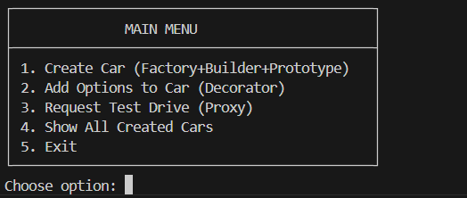
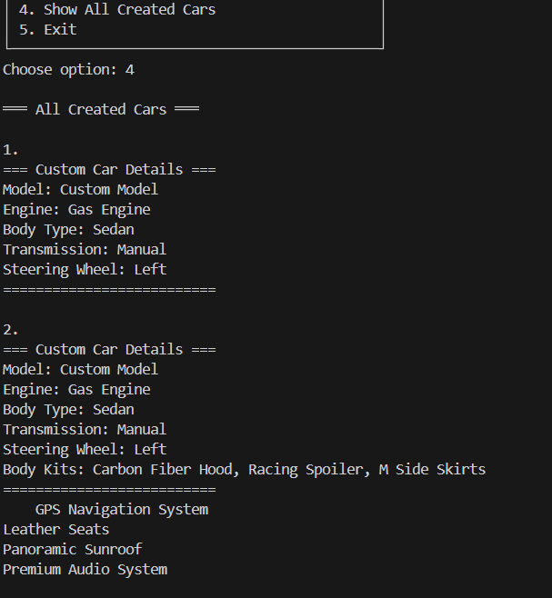

# Car Factory - Structural Design Patterns

**Laboratory Work #2** - Software Design Techniques and Mechanisms  
**Author:** Petcov Nicola

---

## Objectives
1. Study and understand Structural Design Patterns
2. As a continuation of the previous laboratory work, implement additional functionalities using structural design patterns
3. Implement at least 3 structural design patterns in the system:
   - **Decorator Pattern** - for dynamic feature addition
   - **Proxy Pattern** - for access control
   - **Facade Pattern** - for simplified interface to complex subsystems

## Domain Area
**Automotive Manufacturing** - Custom Car Factory System

This project extends the car factory system with structural design patterns. Building upon the creational patterns from Lab #1, the system now offers:
- Dynamic car customization with optional features (Decorator Pattern)
- Controlled test drive access with validation (Proxy Pattern)
- Enhanced car interface for flexible feature composition

---

## Introduction

In software engineering, **Structural Design Patterns** are concerned with how classes and objects are composed to form larger structures. These patterns focus on simplifying the design by identifying simple ways to realize relationships between entities. Unlike creational patterns that deal with object creation, structural patterns deal with object composition and typically identify simple ways to realize relationships between different objects.

### Key Structural Patterns Implemented:

1. **Decorator Pattern** - Dynamically adds responsibilities to objects without modifying their structure
2. **Proxy Pattern** - Provides a surrogate or placeholder to control access to an object
3. **Facade Pattern** - Provides a unified, simplified interface to a complex subsystem

This laboratory work extends the Car Factory system from Lab #1 (which implemented Factory Method, Builder, and Prototype patterns) by adding structural patterns that enhance functionality and control access to the system's features.

---

## Structural Patterns Summary

| Pattern | Purpose | Implementation | Benefits |
|---------|---------|----------------|----------|
| **Decorator** | Add features dynamically | `GPSDecorator`, `LeatherSeatsDecorator`, `SunroofDecorator`, `PremiumAudioDecorator` | Flexible composition, no class explosion |
| **Proxy** | Control access to resources | `TestDriveProxy` with eligibility validation | Security, lazy initialization, logging |
| **Facade** | Simplify complex subsystems | `FactoryApp` unified interface | Reduced complexity, low coupling |

**All three patterns work together:**
- **Facade** provides simple interface to the client
- **Decorator** adds features when requested through facade
- **Proxy** protects resources when accessed through facade

---

## Design Patterns Implementation

### 1. Decorator Pattern 🎨
**Purpose:** Dynamically add optional features to cars without modifying the base car classes

**Problem Solved:**  
Without the Decorator pattern, we would need to create separate classes for every possible combination of car options (CarWithGPS, CarWithGPSAndLeatherSeats, etc.), leading to class explosion. The Decorator pattern allows us to add features dynamically at runtime.

**Implementation:**

The pattern consists of:
- **CarInterface**: Common interface for both base cars and decorators
- **CarDecorator**: Abstract decorator class
- **Concrete Decorators**: GPSDecorator, LeatherSeatsDecorator, SunroofDecorator, PremiumAudioDecorator

**Code Example:**
```java
// Abstract Decorator
public abstract class CarDecorator implements CarInterface {
    protected CarInterface decoratedCar;
    
    public CarDecorator(CarInterface car, double basePrice) {
        this.decoratedCar = car;
        this.basePrice = basePrice;
    }
    
    @Override
    public String getDescription() {
        return decoratedCar.getDescription();
    }
}

// Concrete Decorator
public class GPSDecorator extends CarDecorator {
    public GPSDecorator(CarInterface car) {
        super(car, 0);
    }
    
    @Override
    public String getDescription() {
        return decoratedCar.getDescription() + " + GPS Navigation";
    }
    
    @Override
    public void showDetails() {
        decoratedCar.showDetails();
        System.out.println("    GPS Navigation System");
    }
}
```

**Usage:**
```java
CarInterface car = new CustomCar(...);
car = new GPSDecorator(car);
car = new LeatherSeatsDecorator(car);
car = new SunroofDecorator(car);
// Now the car has all these features dynamically added
```

**Available Options:**
- **GPS Navigation System** - Advanced navigation with real-time traffic
- **Leather Seats** - Premium leather interior
- **Panoramic Sunroof** - Large glass roof panel
- **Premium Audio System** - High-fidelity sound system
- **Premium Package** - All options combined

**Benefits:**
- ✅ Add features dynamically at runtime
- ✅ Avoid class explosion for every feature combination
- ✅ Follow Open-Closed Principle (open for extension, closed for modification)
- ✅ Single Responsibility - each decorator adds one feature
- ✅ Flexible composition - combine decorators in any order

---

### 2. Proxy Pattern 🔐
**Purpose:** Control access to test drive functionality with eligibility checks

**Problem Solved:**  
Direct access to test drives without validation could be dangerous. The Proxy pattern provides a protective layer that validates driver credentials before allowing access to the actual test drive service.

**Implementation:**

The pattern consists of:
- **TestDrive**: Common interface for both proxy and real test drive
- **TestDriveProxy**: Proxy that controls access with validation
- **RealTestDrive**: Actual test drive implementation

**Code Example:**
```java
// Proxy with access control
public class TestDriveProxy implements TestDrive {
    private TestDrive realTestDrive;
    private int driverAge;
    private boolean hasLicense;
    private int drivingExperience;
    
    public TestDriveProxy(int age, boolean hasLicense, int experience) {
        this.driverAge = age;
        this.hasLicense = hasLicense;
        this.drivingExperience = experience;
    }
    
    private boolean checkEligibility() {
        if (driverAge < 18) {
            System.out.println("❌ Access DENIED: Must be 18+");
            return false;
        }
        if (!hasLicense) {
            System.out.println("❌ Access DENIED: License required");
            return false;
        }
        if (drivingExperience < 1) {
            System.out.println("❌ Access DENIED: 1+ year experience required");
            return false;
        }
        return true;
    }
    
    @Override
    public void startTestDrive(CarInterface car) {
        if (!checkEligibility()) {
            return;
        }
        
        if (realTestDrive == null) {
            realTestDrive = new RealTestDrive();
        }
        
        realTestDrive.startTestDrive(car);
    }
}
```

**Validation Rules:**
- ✅ Driver must be at least 18 years old
- ✅ Valid driver's license required
- ✅ Minimum 1 year of driving experience

**Benefits:**
- ✅ Access control and validation before expensive operations
- ✅ Lazy initialization of the real test drive object
- ✅ Logging and monitoring capabilities
- ✅ Protection from unauthorized access
- ✅ Separation of concerns - validation logic separate from test drive logic

---

### 3. Facade Pattern 🎯
**Purpose:** Provide a unified, simplified interface to the complex car factory subsystem

**Problem Solved:**  
The car factory system involves multiple complex subsystems (Factory Method, Builder, Prototype, Decorator, Proxy). Without a Facade, the client would need to understand and interact with all these patterns directly, leading to tight coupling and complex client code. The Facade pattern provides a simple, high-level interface that hides this complexity.

**Implementation:**

The `FactoryApp` class acts as a Facade that:
- Encapsulates all complex pattern interactions
- Provides simple menu-driven interface
- Manages the lifecycle of created cars
- Coordinates between different subsystems

**Code Example:**
```java
public class FactoryApp {
    private List<CarInterface> createdCars = new ArrayList<>();
    
    public void run() {
        Scanner scanner = new Scanner(System.in);
        while (true) {
            showMenu();
            int choice = scanner.nextInt();
            
            switch (choice) {
                case 1: createCarWithAllPatterns(scanner); break;
                case 2: upgradeCarWithDecorator(scanner); break;
                case 3: testDriveWithProxy(scanner); break;
                case 4: showAllCars(); break;
                case 5: return;
            }
        }
    }
    
    // Facade method - hides complexity of Factory + Builder + Prototype
    private void createCarWithAllPatterns(Scanner scanner) {
        // Step 1: Factory Method Pattern
        Engine engine = createEngine(scanner);
        
        // Step 2: Builder Pattern
        CustomCar car = buildCar(scanner, engine);
        
        // Step 3: Prototype Pattern (optional)
        optionallyCloneCar(scanner, car);
        
        createdCars.add(car);
    }
    
    // Facade method - hides complexity of Decorator Pattern
    private void upgradeCarWithDecorator(Scanner scanner) {
        CarInterface selectedCar = selectCar(scanner);
        CarInterface decoratedCar = applyDecorators(scanner, selectedCar);
        updateCar(selectedCar, decoratedCar);
    }
    
    // Facade method - hides complexity of Proxy Pattern
    private void testDriveWithProxy(Scanner scanner) {
        TestDrive proxy = createProxyWithCredentials(scanner);
        CarInterface selectedCar = selectCar(scanner);
        proxy.startTestDrive(selectedCar);
    }
}
```

**Simplified Client Code:**
```java
// Without Facade - Complex client code
Engine engine = new GasEngine();
CustomCar car = new CarBuilder("Model", engine)
    .setBodyType("SUV")
    .setTransmission("Automatic")
    .build();
CarInterface decorated = new GPSDecorator(car);
decorated = new LeatherSeatsDecorator(decorated);
TestDrive proxy = new TestDriveProxy(25, true, 3);
proxy.startTestDrive(decorated);
// Client needs to know about all patterns!

// With Facade - Simple client code
FactoryApp app = new FactoryApp();
app.run();
// Client only interacts with simple menu!
```

**Subsystems Hidden by Facade:**
1. **Engine Factory** (Factory Method Pattern)
2. **Car Builder** (Builder Pattern)
3. **Car Cloning** (Prototype Pattern)
4. **Feature Decoration** (Decorator Pattern)
5. **Test Drive Access Control** (Proxy Pattern)

**Benefits:**
- ✅ Simplified interface for complex subsystems
- ✅ Reduced coupling between client and subsystems
- ✅ Client doesn't need to know about pattern implementations
- ✅ Easy to use - just call menu options
- ✅ Centralized control over all operations
- ✅ Hides complexity of coordinating 5 different patterns

---

### 3. Integration with Creational Patterns (From Lab #1)

The structural patterns work seamlessly with the creational patterns implemented in Lab #1:

**Combined Workflow:**

1. **Factory Method** → Create car with specific engine type
2. **Builder Pattern** → Configure car specifications
3. **Prototype Pattern** → Clone and add body kits (optional)
4. **Decorator Pattern** → Add optional features dynamically ✨ NEW
5. **Proxy Pattern** → Request controlled test drive ✨ NEW
6. **Facade Pattern** → All of the above through simple menu interface ✨ NEW

**Example Flow:**
```java
// 1. Create base car (Factory + Builder)
Engine engine = new GasEngine(); // Factory Method
CustomCar car = new CarBuilder("Model S", engine)
    .setBodyType("Sedan")
    .setTransmission("Automatic")
    .build(); // Builder Pattern

// 2. Add optional features (Decorator)
CarInterface upgradedCar = new GPSDecorator(car);
upgradedCar = new LeatherSeatsDecorator(upgradedCar);

// 3. Request test drive (Proxy)
TestDrive testDrive = new TestDriveProxy(25, true, 3);
testDrive.startTestDrive(upgradedCar);
```

---

## Combined Pattern Flow

The application integrates both Creational (Lab #1) and Structural (Lab #2) patterns:

**Complete Workflow:**

**Lab #1 Patterns (Creational):**
- **STEP 1: Factory Method** → Select engine type  
- **STEP 2: Builder Pattern** → Configure car specifications  
- **STEP 3: Prototype Pattern** → Clone and add body kits (optional)

**Lab #2 Patterns (Structural):** ✨
- **STEP 4: Decorator Pattern** → Add optional features dynamically
- **STEP 5: Proxy Pattern** → Request controlled test drive
- **STEP 6: Facade Pattern** → Unified interface hiding all complexity through `FactoryApp`

## Project Structure

```
src/main/java/
├── client/                          # Client layer (Single client for entire system)
│   ├── Main.java                   # Application entry point
│   └── FactoryApp.java             # Unified UI & application logic
├── domain/
│   ├── decorators/                 # Decorator Pattern (Lab #2) ✨
│   │   ├── CarDecorator.java       # Abstract decorator
│   │   ├── GPSDecorator.java       # GPS navigation option
│   │   ├── LeatherSeatsDecorator.java  # Leather seats option
│   │   ├── SunroofDecorator.java   # Sunroof option
│   │   └── PremiumAudioDecorator.java  # Premium audio option
│   ├── proxy/                      # Proxy Pattern (Lab #2) ✨
│   │   ├── TestDrive.java          # Test drive interface
│   │   ├── TestDriveProxy.java     # Proxy with access control
│   │   └── RealTestDrive.java      # Real test drive implementation
│   ├── factory/                    # Factory Pattern (Lab #1)
│   │   └── CarFactory.java         # Factory Method pattern
│   └── models/                     # Domain models
│       ├── Car.java                # Abstract car class
│       ├── CarInterface.java       # Common interface for cars & decorators ✨
│       ├── CarBuilder.java         # Builder pattern
│       ├── CarType.java            # Enum for car types
│       ├── CustomCar.java          # Custom car with Prototype pattern
│       ├── BodyKitModel.java       # Predefined body kit models
│       ├── ElectricCar.java        # Concrete electric car
│       ├── GasCar.java             # Concrete gas car
│       ├── Engine.java             # Engine interface
│       ├── ElectricEngine.java     # Electric engine implementation
│       └── GasEngine.java          # Gas engine implementation
```

**Key Architectural Decisions:**
- ✅ Single client (`FactoryApp.java`) for the entire system
- ✅ Patterns grouped by responsibility (decorators, proxy, factory, models)
- ✅ Clear separation between creational and structural patterns
- ✅ All object creation buried in domain logic, not exposed to client

## How to Run

```bash
# 1. Navigate to project root
cd /home/fuckedupupd/SDTM-Labs

# 2. Compile the project
mvn clean compile

# 3. Run the application
mvn exec:java
```

---

## Screenshots

### 1. Main Menu - Facade Pattern ✨


*Main menu showing the **Facade Pattern** in action - `FactoryApp` provides a simple unified interface that hides the complexity of 5 design patterns (Factory Method, Builder, Prototype, Decorator, Proxy)*

**Key Point:** Instead of the client needing to understand and coordinate all patterns, the Facade provides simple menu options that handle all complexity internally.

---

### 2. Create Car Flow (Creational Patterns - Lab #1)

#### Step 1: Factory Method - Engine Selection


*Selecting engine type using Factory Method pattern*

#### Step 2: Builder Pattern - Car Configuration


*Building custom car with specifications*

#### Step 3: Prototype Pattern - Clone & Body Kits


*Cloning car and applying predefined body kit models*

---

### 3. Decorator Pattern - Adding Optional Features ✨


*Dynamically adding features to an existing car (GPS, Leather Seats, Sunroof, Premium Audio)*

**Demonstrates:**
- Selecting a car from created cars list
- Choosing optional features to add
- Features stacking on top of each other
- Updated car details showing all added options

---

### 4. Proxy Pattern - Test Drive Access Control ✨


*Successful test drive after passing eligibility checks*

**Demonstrates:**
- Driver information input (age, license, experience)
- Eligibility validation passing
- Access granted to test drive
- Test drive execution

---


*Test drive denied due to failed eligibility check*

**Demonstrates:**
- Failed validation (age < 18, no license, or insufficient experience)
- Access control protecting the system
- Clear error messages explaining denial reasons

---

### 5. All Created Cars View


*Displaying all created and customized cars with their features*

---

## SOLID Principles Applied

| Principle | Implementation | Example |
|-----------|---------------|---------|
| **Single Responsibility** | Each class has one clear purpose | `CarDecorator` only adds features, `TestDriveProxy` only controls access |
| **Open-Closed** | Open for extension, closed for modification | Add new decorators without modifying existing code |
| **Liskov Substitution** | Decorators and proxies implement same interfaces | `CarInterface` implemented by both cars and decorators |
| **Interface Segregation** | Small, focused interfaces | `TestDrive` interface has only one method |
| **Dependency Inversion** | Depend on abstractions | `CarDecorator` depends on `CarInterface`, not concrete classes |

---

## Key Features

### Creational Patterns (Lab #1)
- ✅ Factory Method for engine creation
- ✅ Builder Pattern for complex car construction
- ✅ Prototype Pattern for car cloning and body kits

### Structural Patterns (Lab #2) ✨
- ✅ **Decorator Pattern** - Dynamic feature composition
- ✅ **Proxy Pattern** - Access control and validation
- ✅ **Facade Pattern** - Unified simplified interface for complex subsystems
- ✅ **Seamless Integration** - Patterns work together cohesively

### Architecture
- ✅ **Single Client** for the entire system (`FactoryApp.java`)
- ✅ **Clean Package Structure** - patterns grouped by responsibility
- ✅ **Pure Java** - no external frameworks
- ✅ **Interactive CLI** with clear user guidance
- ✅ **Extensible Design** for future enhancements
- ✅ **SOLID Principles** throughout the codebase

---

## Technologies

| Technology | Version | Purpose |
|------------|---------|---------|
| **Language** | Java 21 | Core programming language |
| **Build Tool** | Maven 3.x | Dependency management and build |
| **Architecture** | Layered | Client → Domain (Factory, Models, Decorators, Proxy) |
| **Patterns** | 6 Design Patterns | 3 Creational + 3 Structural |

---

## Conclusions

### Lab #2 Achievements:

This laboratory work successfully extends the Car Factory system with **Structural Design Patterns**, demonstrating how they complement the creational patterns from Lab #1.

#### Key Accomplishments:

1. **Decorator Pattern Implementation**
   - Enables dynamic feature addition without modifying base car classes
   - Avoids class explosion (no need for hundreds of car+feature combinations)
   - Provides flexible, runtime composition of features
   - Follows Open-Closed Principle perfectly

2. **Proxy Pattern Implementation**
   - Adds essential access control for test drive functionality
   - Validates driver credentials before allowing access
   - Implements lazy initialization of expensive resources
   - Provides logging and monitoring capabilities

3. **Facade Pattern Implementation**
   - Provides unified interface to complex subsystem of 5 patterns
   - Hides complexity from client code
   - Single point of interaction (`FactoryApp`) for entire system
   - Simplifies usage - client doesn't need to understand pattern internals
   - Reduces coupling between client and domain logic

4. **Seamless Pattern Integration**
   - All 6 patterns (3 creational + 3 structural) work together cohesively
   - Facade coordinates all patterns transparently
   - Clean separation of concerns with proper package structure
   - Object creation mechanisms are buried in domain logic

4. **Architecture Quality**
   - SOLID principles applied throughout
   - Clean, maintainable, and extensible codebase
   - Proper separation between client and domain layers
   - Professional package organization by responsibility
   - Facade pattern ensures low coupling and high cohesion

#### Real-World Applications:

The implemented patterns solve real software engineering problems:

- **Decorator**: Similar to how UI frameworks add features to components (borders, scrollbars, etc.) or Java I/O streams
- **Proxy**: Like authentication middleware in web applications, virtual proxies for lazy loading, or remote proxies in distributed systems
- **Facade**: Like APIs that hide complex backend logic, or simplified SDKs that wrap complex libraries

#### Learning Outcomes:

- Understanding how structural patterns organize object relationships
- Practical experience combining creational and structural patterns
- Appreciation for composition over inheritance (Decorator pattern)
- Importance of controlled access in complex systems (Proxy pattern)
- Value of simplified interfaces for complex subsystems (Facade pattern)
- How patterns can work together to create robust architectures


---

**Interactive Menu:**
1. Create Car with creational patterns (Factory + Builder + Prototype)
2. Add features with Decorator pattern
3. Request test drive with Proxy pattern validation
4. View all created cars
5. Exit

---

## Repository Information

- **Course**: Software Design Techniques and Mechanisms
- **Laboratory**: #2 - Structural Design Patterns
- **Author**: Petcov Nicola
- **Patterns Implemented**: 
  - Creational (Lab #1): Factory Method, Builder, Prototype
  - Structural (Lab #2): Decorator, Proxy, Facade

---
